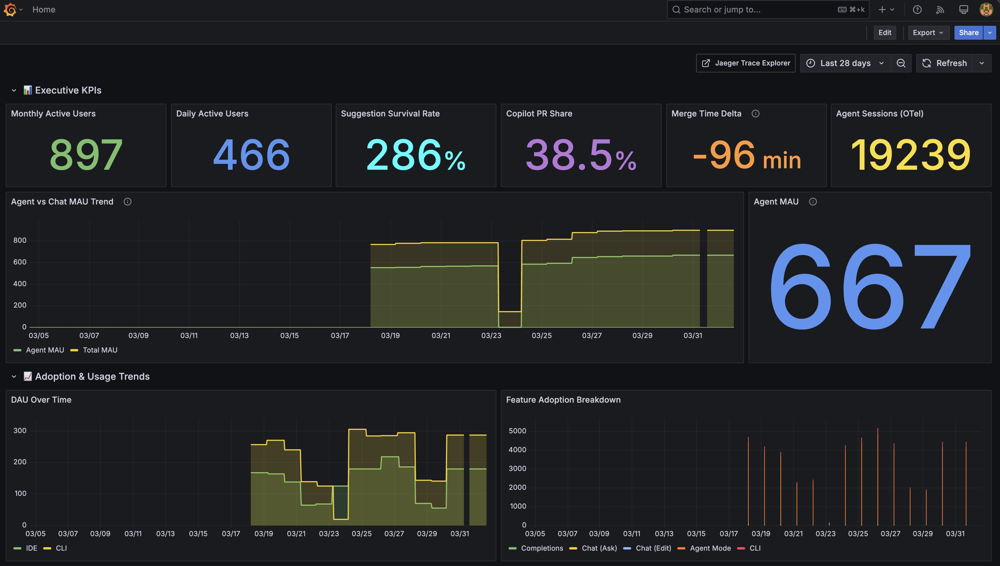
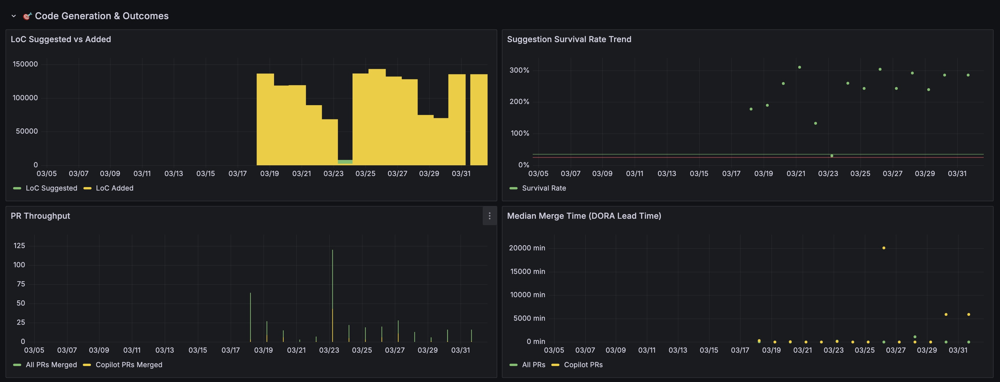
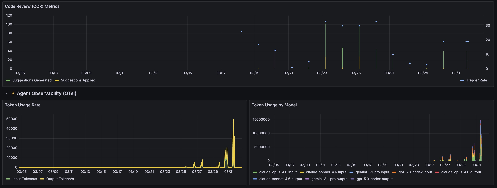
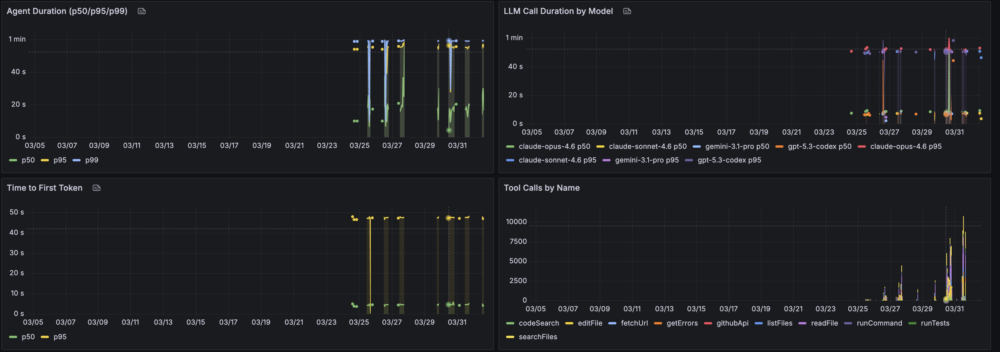
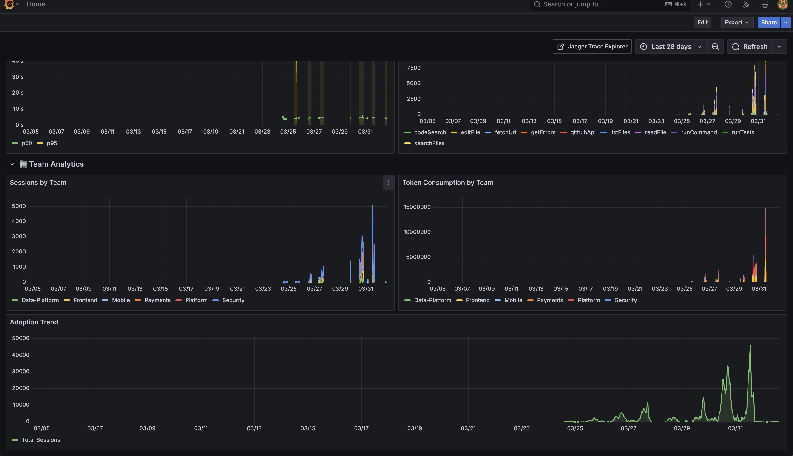
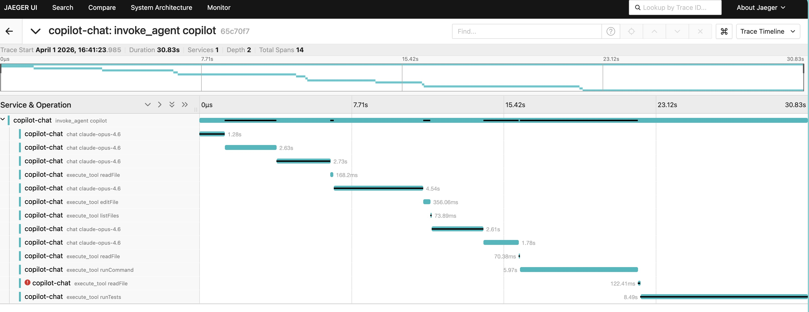

# ObserVader

Turn raw Copilot telemetry into executive-ready KPIs, cost analysis, and agent traces — see exactly where your AI coding investment is paying off, and where it isn't.

> This is a seeded reference demo for local reproducibility — not a production deployment target.
> Live enterprise adapters and secret-backed integrations belong in private forks.

## Three Problems This Solves

1. **"Are developers actually using Copilot?"** — Adoption dashboards track DAU/MAU, feature breakdown, and team-level engagement
2. **"Is the AI-generated code surviving?"** — Survival rate, LoC metrics, and PR lifecycle panels show real code impact
3. **"What's the agent actually doing?"** — OTel traces and latency breakdown across Claude, GPT, and Gemini models

> **Multi-model visibility**: see cost and latency across Claude, GPT, and Gemini models side-by-side in a single dashboard.

## What You'll See


*Executive KPIs give leadership a single-glance health check on Copilot ROI.*


*Code Generation panels track whether AI-suggested code actually survives to production.*


*Code Review metrics and Agent Observability show token consumption across models in real time.*


*Agent Performance panels surface p50/p95 latency, Time to First Token, and tool call distribution.*


*Team Analytics break down sessions and token spend by department for cost allocation.*


*Jaeger trace waterfall shows the full agent interaction: LLM calls, tool executions, and latency breakdown.*

## Architecture

| Component | Role |
| --- | --- |
| **Grafana** | Unified dashboard visualization |
| **Prometheus** | Metrics query and storage |
| **OTel Collector** | Telemetry intake and export (OTLP HTTP) |
| **Jaeger** | Distributed trace exploration |
| **Seeded data** | Deterministic sample data for repeatable demos |

## Quick Start

```bash
cd demo
./demo-up.sh          # Full seeding (~2 min first time)
```

| Flag | Time | When to use |
|---|---|---|
| `./demo-up.sh` | ~2 min | First run — full fidelity seeding |
| `./demo-up.sh --fast` | ~15s | Urgent demo — fewer waves, shorter delays |
| `./demo-up.sh --skip` | ~5s | Restart — data persisted in Docker volumes |

Data is persisted across restarts via Docker volumes (Prometheus, Pushgateway, Grafana).
To wipe everything and start fresh: `./demo-teardown.sh && docker volume prune`.

<details>
<summary>Manual steps (if you prefer running each stage separately)</summary>

```bash
cd demo
docker compose up -d
python3 scripts/generate_sample_data.py
python3 scripts/push_pr_metrics.py
python3 scripts/push_usage_metrics.py
npx tsx seed-data.ts            # add --fast for reduced waves
npx tsx seed-cli-data.ts        # add --fast for reduced waves
```

</details>

Then open:
- Grafana: http://localhost:3001 (two dashboards: Unified + ROI & Cost Efficiency)
- Jaeger: http://localhost:16686 (services: copilot-chat, github-copilot)
- Prometheus: http://localhost:9090

For endpoint realism details and protocol-shape mapping, see [docs/runbook/public-demo-quickstart.md](docs/runbook/public-demo-quickstart.md).

## KPI Reference

For a complete breakdown of every metric, formula, and data source — including ROI math and signal coverage — see the [Copilot Metrics & ROI Playbook](docs/architecture/copilot-metrics-playbook.md).

Highlights:
- **Adoption**: DAU/MAU, CLI adoption rate, agent adoption %, feature breakdown
- **Code Impact**: Suggestion survival rate, LoC added, agent contribution %
- **PR Lifecycle**: Copilot PR share, merge time delta, code review apply rate
- **Agent Observability**: Duration percentiles, TTFT, token usage, tool call distribution
- **Cost & Efficiency**: Cost per session, AI units, cache hit ratio, context pressure

## Repository Layout

```
demo/                  Runnable local stack, dashboards, and seed scripts
docs/architecture/     Architecture references
docs/runbook/          Endpoint realism and operating runbooks
docs/screenshots/      Dashboard screenshots
```

## Security and Scope

- Sample/seeded-data first — no live API calls, no customer identifiers in defaults
- Enterprise tokens, customer endpoints, and secret-backed adapters are excluded
- Public Azure hosting is intentionally deferred; optional guidance for fork maintainers only

## Continuous documentation

A weekly [agentic workflow](.github/workflows/docs-sync.md) (powered by
[GitHub Agentic Workflows](https://github.github.com/gh-aw/)) sweeps the
Copilot Metrics API docs, OpenTelemetry GenAI semantic conventions, and
the GitHub Copilot changelog, and opens a draft PR with proposed
additive updates to `docs/` and `.github/skills/`. The agent runs in a
sandboxed container with a read-only token and a domain-allowlisted
firewall — every PR is gated by [`monthly-maintenance.yml`](.github/workflows/monthly-maintenance.yml)
checks plus [CODEOWNERS](.github/CODEOWNERS) review before it can merge.
Nothing auto-merges.

> Optional: set the `GH_AW_CI_TRIGGER_TOKEN` repo secret (a fine-grained
> PAT with `Contents: R/W`) so PRs created by the agent trigger CI
> checks. See the [gh-aw triggering-CI guide](https://github.github.com/gh-aw/reference/triggering-ci/).

## Credits

Inspired by [copilot-opentelemetry](https://github.com/pierceboggan/copilot-opentelemetry) and practical Copilot observability workflows.
