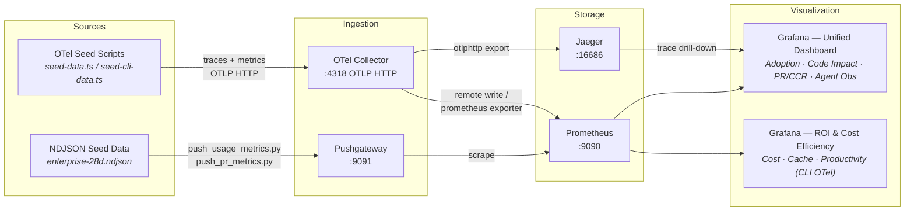

# Public Architecture Summary

- Public architecture is intentionally local-demo-first and seeded-data-first.
- Usage metrics are represented by seeded NDJSON generation in `demo/sample-data`.
- OTel telemetry is seeded to OTLP HTTP and flows through OTel Collector into Prometheus and Jaeger.
- Grafana provides two dashboards:
  1. **Copilot Metrics — Unified Dashboard**: adoption, code impact, PR/CCR, and agent observability
  2. **Copilot ROI & Cost Efficiency**: cost, cache efficiency, and productivity impact (CLI OTel data)
- Jaeger provides trace drill-down for seeded agent interactions.
- Live enterprise/customer adapters and secret-backed integrations are intentionally excluded from this public repo.

## Data Flow

